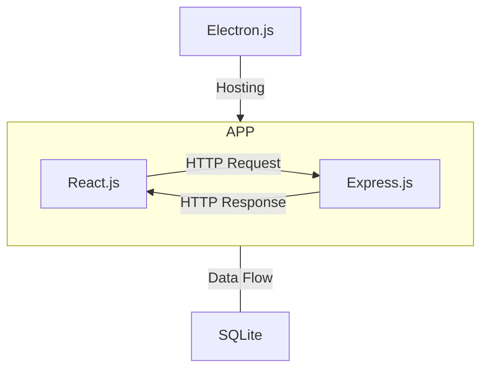

# Pour la Money

***Pour la Money*** is an application that helps people to manage and summaries their financial transactions data.

## Structure

## Installation

1. Firstly, install all dependencies.
    ~~~
    yarn install
    ~~~
2. Then, rebuild package for Electron.
    ~~~
    ./node_modules/.bin/electron-rebuild
    ~~~
3. Now you can start the app!
    ~~~
    yarn start
    ~~~

## Release

Run different build command for different environments.

~~~
// Windows
yarn build-win

// MacOS
yarn build-mac
~~~
